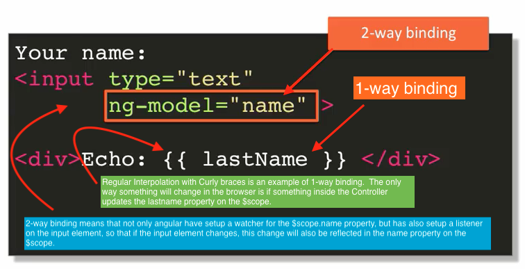
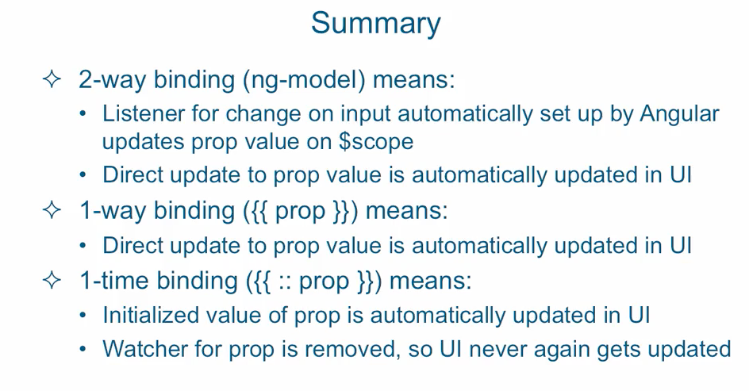

## 2-way, 1-way & 1-time binding

 

> As a note, the more bindings you create, the more watchers will be added by angular.       
> Digest goes through every watcher in the application and checks for any changes in the
> last loop. The more watchers, the larger the impact in performance.        
> No more than 2000 watchers per page is recommended.

### 1-time bindings

- Minimizing the number of `live active watchers`, is something that is `desirable`.
- this can be done with 1-time binding
- `1-time binding` is similar to `two-way binding`, except that in front of the property    
  name you put `::` double colons. That tells angular to setup a watcher for that property.
  As soon as app initializes, the digest cycle kicks in, updates property in UI and then it removes the watcher.

 

 

