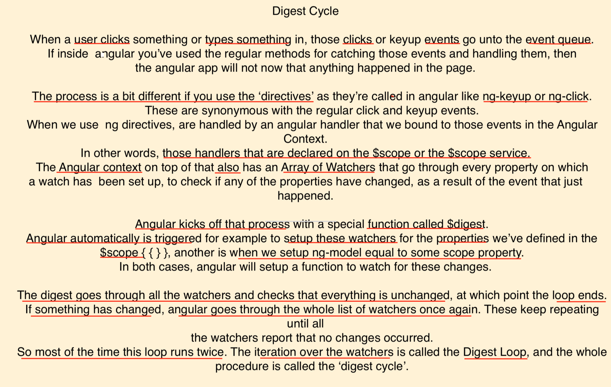
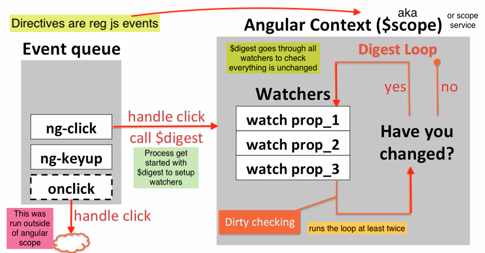
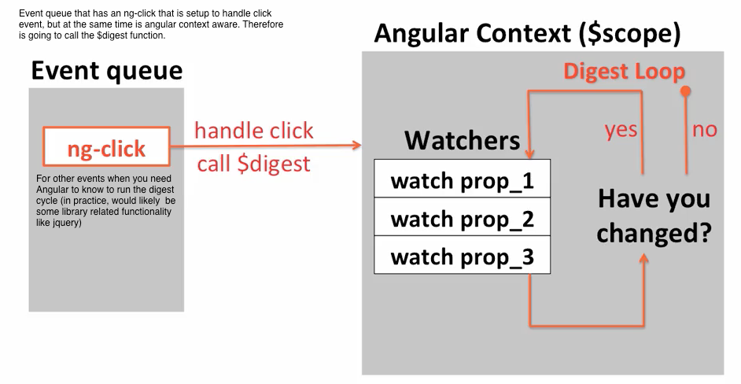

## digest cycle



<br/>


<hr/>



<br/>




<br/>


### example of a function that gets executed outside angular context/$scope

```
    function MainController($scope) {
        $scope.counter = 0;

        $scope.fireOffCounter = function() {
            setTimeout(function() {
                console.log('fire off');
                $scope.counter++;

            },2000);
        
        };
    }

    // it doesn't  update counter correctly and that's because it gets taken out
    // of the angular context, so the digest cycle does not kicks off. 
    
    // So what you can do is:
       kick off the digest manually. By adding:

    =>    $scope.$digest();

```


- about using `$scope.$digest()`
    + any exceptions that happen in the code that we are executing, wil not be visble
      to angular

- how to make exceptions visible to angular?
    + $apply in the form of an anonymous function that'll have the code to execute


```
    ex: // $apply, that brings event into the angular $scope/context and
        // makes whatever exceptions it throws visible to angular

            function MainController($scope) {
                $scope.counter = 0;

                $scope.fireOffCounter = function() {        //here timeout causes it
                    setTimeout(function() {                 //fall off context
                        $scope.$apply(function() {          //rather than using $apply in
                            $scope.counter++;               //this particular case
                            console.log('incremented');     //we could have used, the
                        });                                 // angular timeout service
                                                            // native to angular
                    },2000);    

                };
            }


```

- example using $timeout service instead

```
        MainController.$inject = ['$scope', '$timeout'];

        function MainController($scope,$timeout) {
            $scope.counter = 0;

            $scope.fireOffCounter = function() {
                $timeout(function() {
                    $scope.counter++;
                    console.log('incremented');
                },2000);
            };
        }

```


