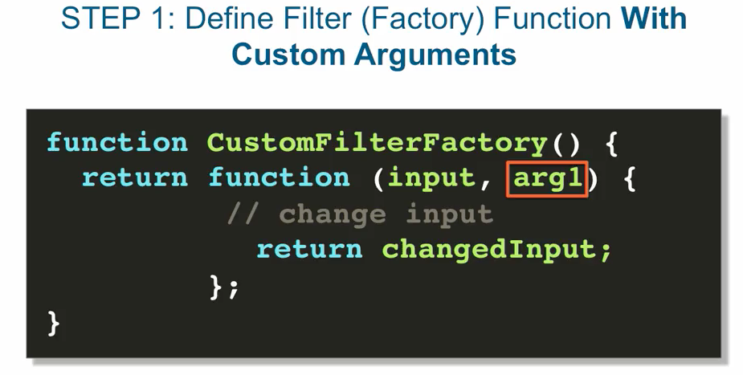
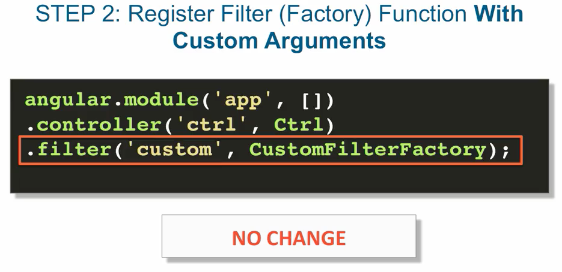
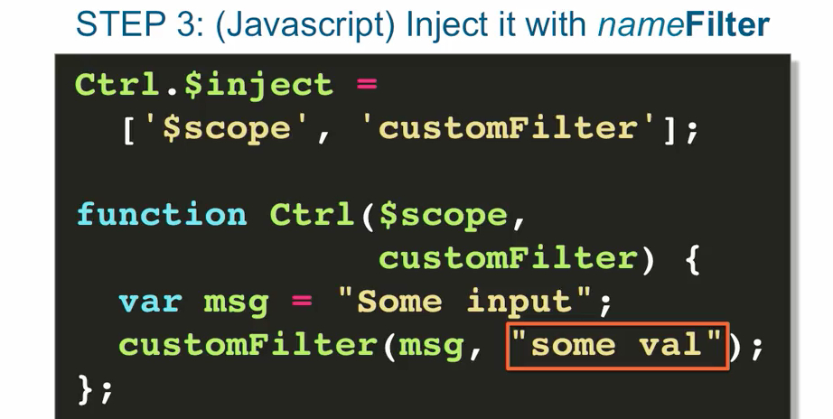
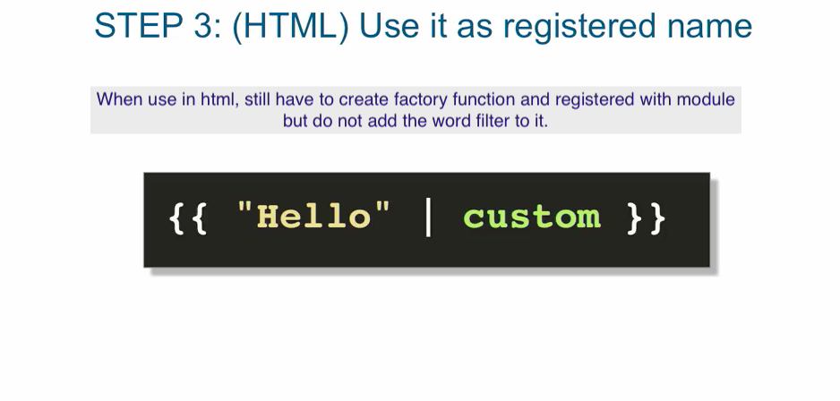
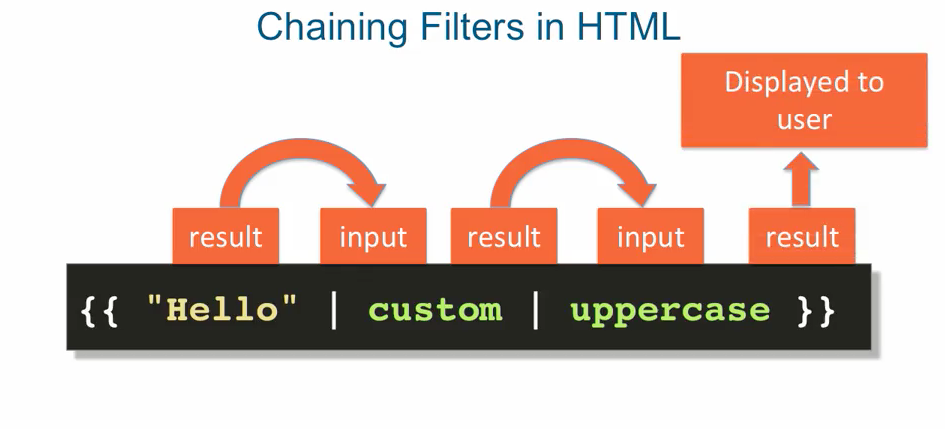

## Filters, digest cycle and data biding  (slides at the bottom)

- we use `filters` to `manipulate` the `data` into the format we want
- allows you to `change` the `output` of an `expression` in angular {{}}

```
    ex: (uppercase filter)

    // we'll need to first inject the filter service in our controller    
    // in order to use it in our code.

    var output = $filter('uppercase')(value);
                |___________________| |_____|
                    creates a filter    it gets executed
                       function         using the params right after it.

    // when you call the filter service, specifying the filter function you want to
    // instantiate, like uppercase here, the filter service calls the `uppercase filter 
    // factory`. Once you got the filter factory, you can executed with a supply value.
    
    //other filters:
    lowercase, currency, number, etc..

```

- custom arguments can change the way the filtering function is filtering


```
    ex:

        var output = 
        $filter('currency')
        (value,
         customArg1,
         customArg2);

         // to change the expression output
         // you pass custom arguments.

```

- filters can be used straight in Html

```
    ex:

        {{"hello" | uppercase }}

        // just by `placing` a `pipe` between the `output` of some `expression`
        // and the `name` of the `filter`

        * it can also be $scope.value, assuming value is 'hello' in controller


        //also custom arguments

        {{ "hello" | currency : arg1 : arg2 }}

        * they just need to be separated by a colon  

        //example of custom currency

        {{"24" | currency : '#bu£' }}


```

### creating custom filters

<br>



<br>


    - at a minimum, the filter function itself takes some input as an argument and    
      and usually returns some manipulated version of that input, in other words     
      the filter output.
    - this is the function that creates and returns an instance of our filter function.


<br>



<br>


* step 2 We need to Register filter factory with module
    - similar to registering controllers (by doing `.controller` on the module)    
    - we do that by calling the filter method with name of filter and filter factory
      responsible for creating the filter

      + ex:

        .filter('custom', CustomFilterFactory);


```
    ex:

        angular.module('app',[])
        .controller('ctrl', Ctrl)
        .filter('custom', CustomFilterFactory);


```


<br>



<br>


* step 3 Inject it with nameFilter

    - you just use the filter, like inside a controller, using the name of the filter,
      plus the word 'Filter' attached to it.

```
    ex:
        //note: calling `customFilter` actually calls the filter function

        //previous examples, calling the filter service doesn't call the filter function,   
        // simply create the filter function for us


        Ctrl.$inject = ['$scope', 'customFilter'];

        function Ctrl($scope,customFilter) {
            var msg = "Some input";
            customFilter(msg);
        }

        // angular appends the name `Filter` to the end of factory name.

```

### custom filter example

```
    //module
    var meApp = angular.module('meApp',[]);
    //controller
    var MainController = meApp.controller('MainController', MainController);
    
    //register filter factory
    MainController.filter('clast',FirstIsLast);
    
    //inject to controller
    MainController.$inject = ['$scope','clastFilter'];

    //controller fn
    function MainController($scope,clastFilter) {

        ...

    }

    //factory function
    function FistIsLast() {
        return function(input) {
            return inputChanged;
        };

    }


```

### custom filter with additional arguments


<br>



<br>


<br>



<br>


### filter factory with arguments

```

    //filter factory
    function seekNreplace() {
        return function(input,target,replaceWith) {
            var input = input || '';
            input = input.replace(target,replaceWith);
            return input;
        }
    }


    //filter function in controller
    $scope.seekNrep = function(x,y) {
            sen = $scope.sentence;
            var replace = sekreplaceFilter(sen,x,y);
            console.log(replace);
            var output = $scope.sentence = replace;
            return output;
            
    };

    // MainController
    MainController.filter('sekreplace', seekNreplace);

    //inject to ctrl
    MainController.$inject = ['$scope', 'likesloveFilter', 'sekreplaceFilter'];

```


