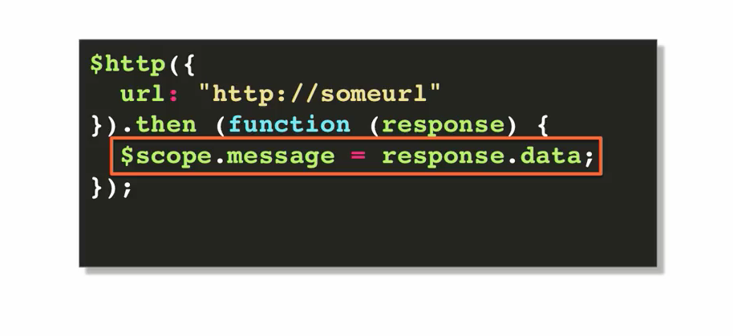

## http service - ajax

- this is a core angular service (an asynchronous service)
- the idea here is to make communication between the front end application and the server
  simple and straightforward
- the http service is itself a function, so it can be call directly

- it's based on the deferred and promised API expose by the $q service
- when invoked, the main methods in this service return a promise; which then we get to 
  process.

- $http service takes one argument, a configuration object with properties like, 'method',
  'url', 'params' and returns a promise.


  ```
    ex:

        $http({
            method: "GET",          //if none specified, GET is assumed    
            url: "http://someUrl",          //only required property
            params: {
                param1: "value1"    //http://someurl?param1=value1
            }                       //param values are automatically url encoded
        }).
        then(...);


  ```


- the arguments that you pass into the 'then' function are the same you would usually pass
  into a promise.

```
    ex:

        $http({
            url: "http://ukrightmove.co.uk"
        })
        .then(
        function success(response) {//automatically parses json
            //do something with response.data
        },
        function error(response) {
            //do something with error response
        });


```

### problem to avoid

- using $scope at the end of your async function, especially if you set the value of the 
  $scope.property (ex: $scope.message = '') to an empty string

- you should use $scope.message within the 'then' function.

ex:





### summary

- $http service is based on the promise api exposed to by $q
- $http itself is a function
    + takes a single config obj as parameter (url only req prop)
    + returns a promise to be resolved with the '.then' function

- response.data property holds the server data response
- angular returns json strings into javascript objects automatically
- module.constant can be used as an injectable constant


