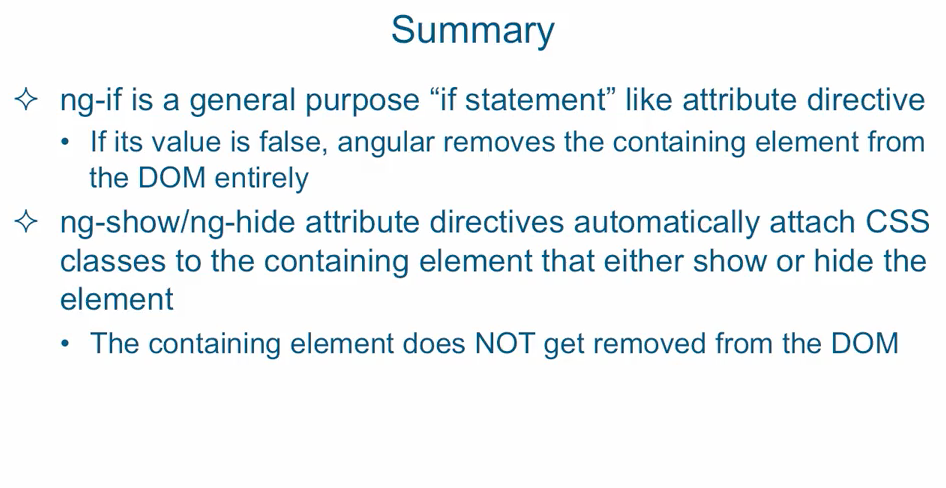

## ng-if, ng-show, ng-hide


### ng-if

```
    <div ng-if="evaluates to true">something</div>
```

if the condition is true, the entire div is shown. If that condition is false, it evaluates
to false - as if the div does not exist. It gets commented out.


### ng-show

- does exactly the same thing as ng-if, except that it will not remove the div from the
  document object model. Angular adds special classes so that it remains hidden.

### ng-hide

- opposite of ng-show    

```
    <div ng-hide="!evaluatestotrue">something</div>
```




