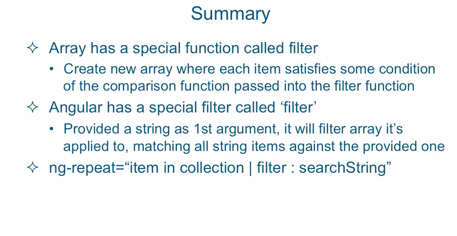

## ng-repeat

- `ng-repeat` construct to loop over data and output the result of that looping to 
   the web page

- `ng-app`, `ng-controller`, `ng-repeat` are directives

```
    ex: syntax

    <li ng-repeat="item in shoppingList">
        {{ $index + 1}}. Buy {{ item.quantity }} of {{ item.name  }}
    </li>

    //also we're setting up watches with the curly braces
    // one for each property - interpolation type


    //setting up ng-model to watch just one item on the list

    <input type="text" ng-model="shoppingList2[0].quantity">

```


- adding a new item to the list

```
    ex:
        //adding a list item from  an ng-model scope property
    
        function ShoppingListController($scope) {
            $scope.shoppingList1 = shoppingList1;
            $scope.shoppingList2 = shoppingList2;
            //new item
            $scope.newItemName = '';
            //new qty
            $scope.newItemQty = 0;

            $scope.addToList = function() {
                var newItem = {
                        name: $scope.newItemName,
                        qty: $scope.newItemQty
                };

                $scope.shoppingList2.push(newItem);
                  
            };
            
        } //ShoppingList controller


```

- special filter called filter

``` 
    ex: famous example

    <input ng-model="search">

<ul>
    <li ng-repeat="item in collection | filter: searchString">
        {{item}}
    </li>
</ul>
```




