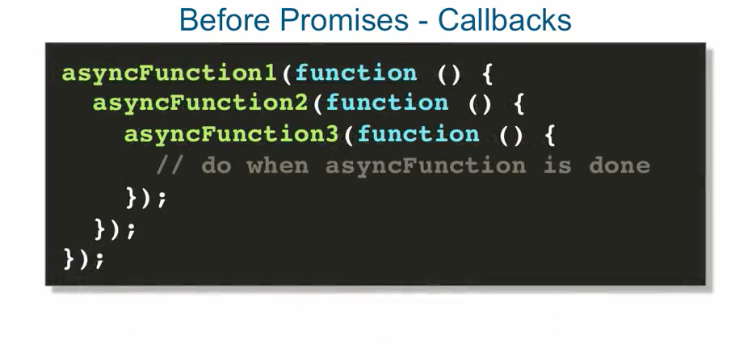

## Asynchronous Behaviour with Promises and $q

- before promises we had callbacks, where you would pass a function as an argument value, 
  that would get executed, once the asynchronous behaviour was complete.

```
    asynchFunction(function() {
        // do when asyncFunction is done.
    });

```


- complaint => there wasnt an easy/straightforward way to pass the results of async functions
  back to the caller. Especially the case, when the caller is a few layers away.
  (in order to propagate the result all the way to the top)

- this here is when promises are most useful in my opinion ...and that's without even
  error handling

  


### Promise api (part of the es6 api)

- object which can be passed around or returned that holds references to the outcome of
  asynchronous behaviour.
- not all browsers implement es6 api yet.

- angularJS implements its own Promise API, that's very similar to the es6 one.

- a promise is an object that can be passed around, or returned that holds references to the
  outcome of asynchronous behaviour.

- in angular promises are created through the special service called ***$q*** service.


