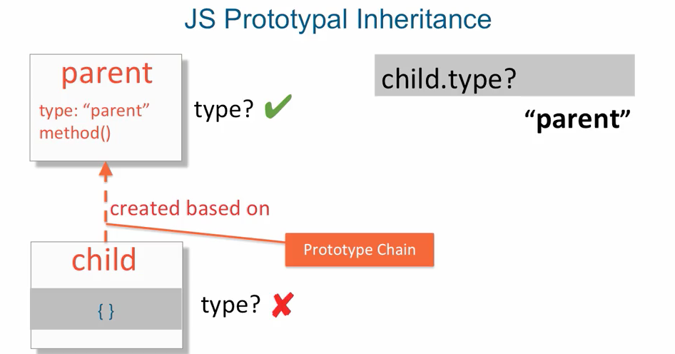
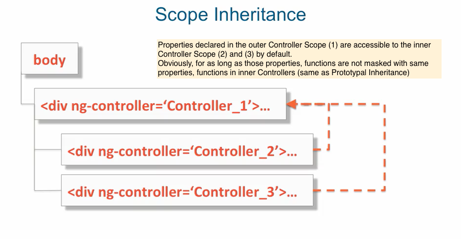
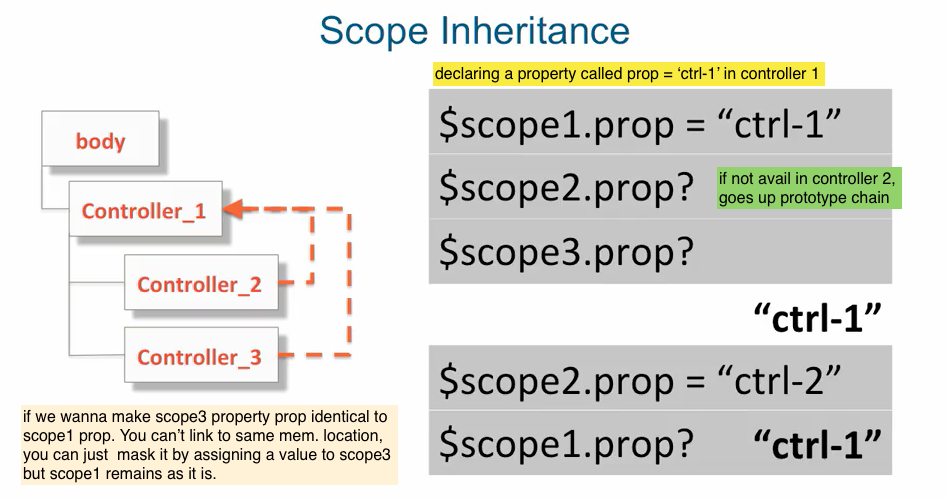
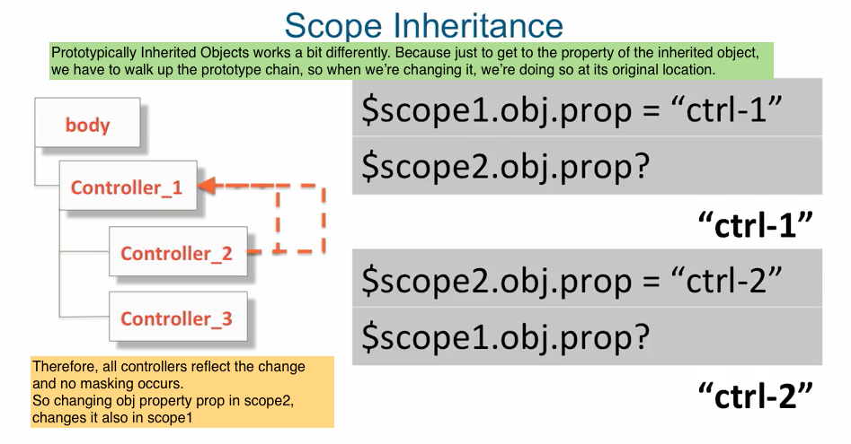
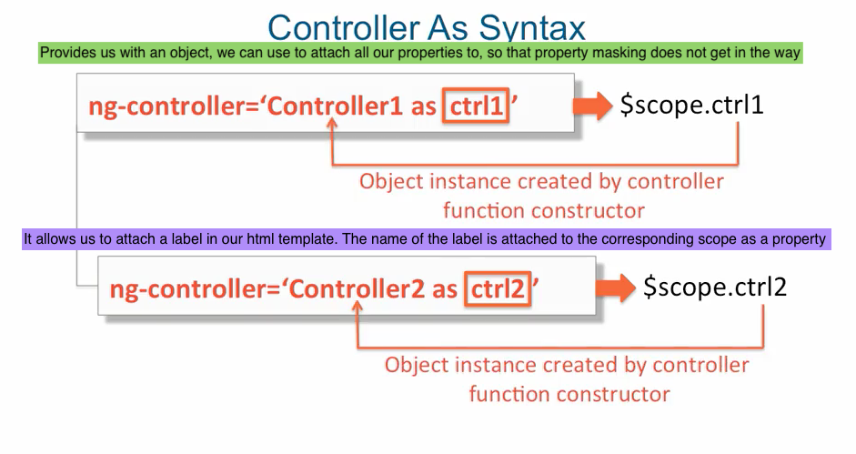
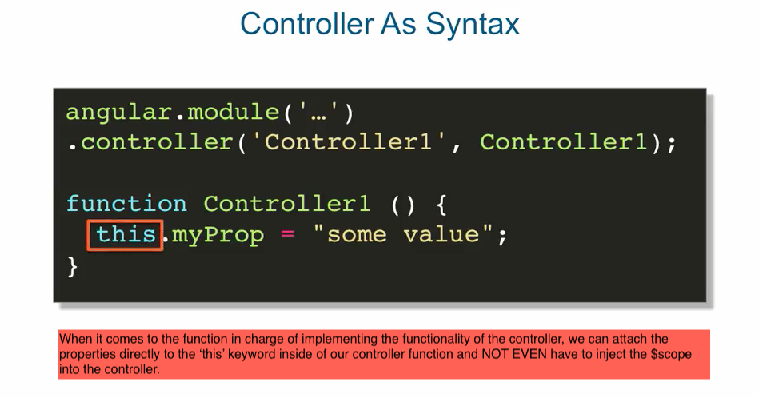
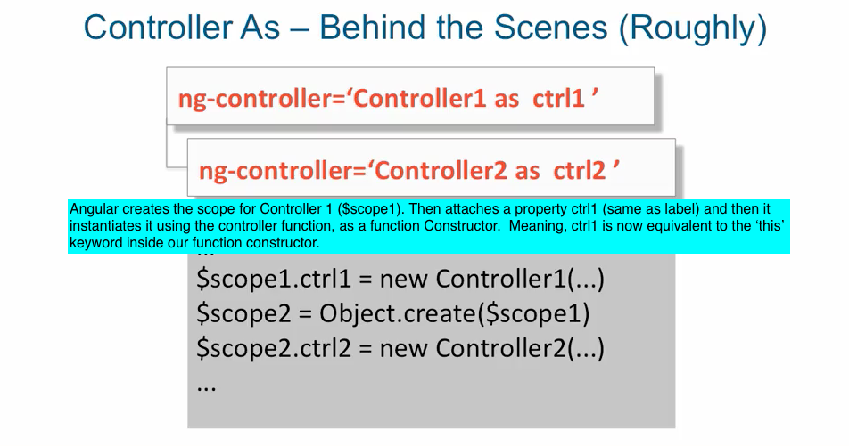

## prototypal inheritance & Scope Inheritance

- Inheritance is when an object or a class is based on another object or a class (parent)
  using the same implementation and/ or the same values.

```
    ex: 
        Animal object or class
            - properties: number of legs
            - method: walk() 


        Dog object or class             // where dog has access to the number of legs
            - number of legs            // properties and also the walk method.
            - walk


```

> Object oriented inheritance is based on classes

** Prototypal inheritance is based in object instances
    + the original object becomes the prototype for all subsequently created objects.
    + it's called prototype chain because it doesn't have to be limited to just one
      object in its subsequent child, it can have grandchildren and so forth. In other
      words you can create another object that is based on the child object and therefore
      the current parent will then become the grandparent of that newly created object. 




```
    var parent = {
        value: "parentValue",
        obj: {
            objValue: "parentObjValue"
        },
        walk: function() {
            console.log("walking");
        }
    
    };

    var child = Object.create(parent);
    console.log("Child - child.value: ", child.value);
    console.log("Child - child.obj.objValue: ", child.obj.objValue);
    console.log("Parent- parent.value: ", parent.value);
    console.log("Parent- parent.value: ", parent.value);
    console.log("Parent- parent.obj.objValue: ", parent.obj.objValue);
    console.log("Parent: ", parent);
    console.log("Child: ", child);

```

## Scope Inheritance

- It's not common/good practice to have one controller that handles everything in your page.
- It's much easier to code smaller pieces of functionality that are responsible for smaller   
  parts of your page.
- When you declare that a controller is responsible for a part of your page, some natural 
  nesting of controllers will occur.
- Therefore the scope service/ scope of the outer controller, is available to the inner
  controllers.


  

<br/>

  


<br/>

  


<br/>

  


<br/>

  


  <br/>

  


