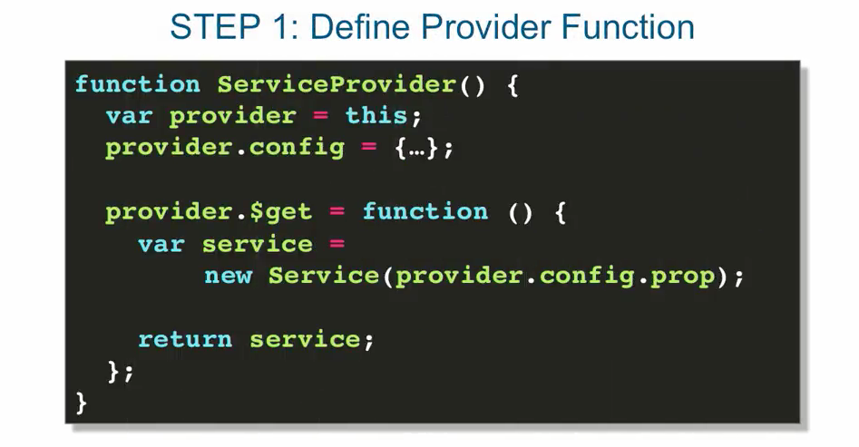
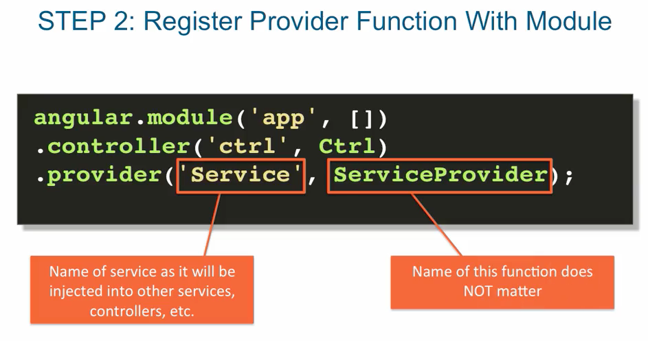
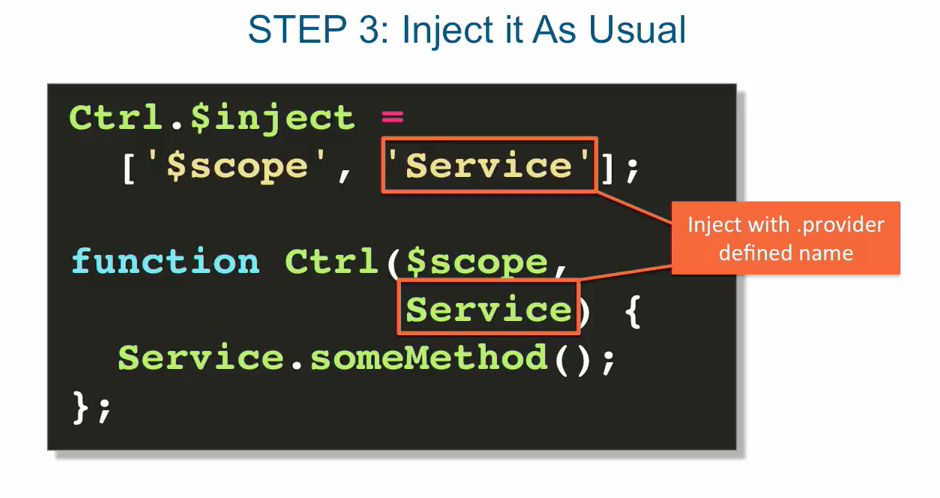
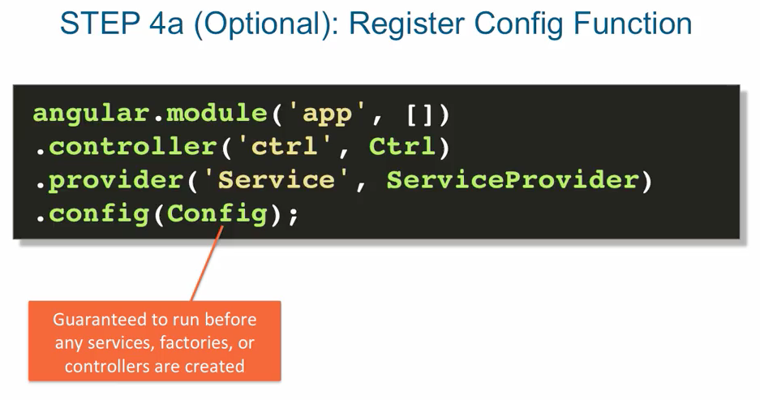
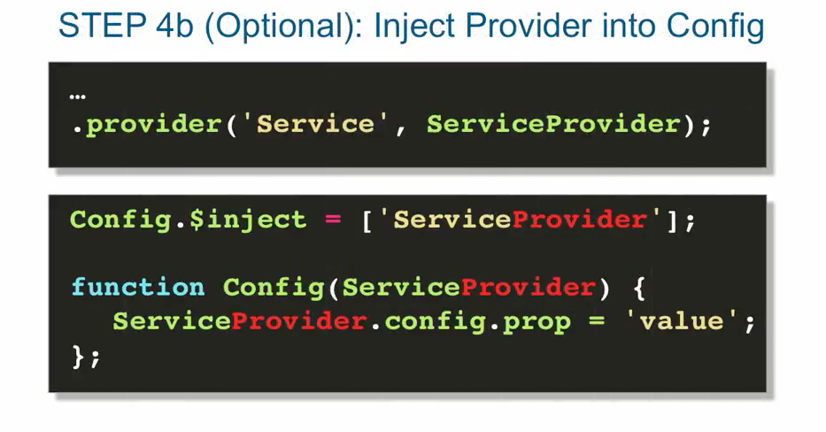

## custom services with .provider()

- . provider() is the most flexible method of creating services in Angular.
- from creating a factory that's dynamically configurable, with provider you can
  custom configured the factory just once at the bootstrapping of your entire application,
  and use the factory through out your application with your custom settings. In other words
  configure the factory, before your application starts.

- the provider method is what actually gets executed behind the scenes when we configured
  our services with either .service or .factory methods.

### steps for using .provider method

- optional default config

- optional define config function

