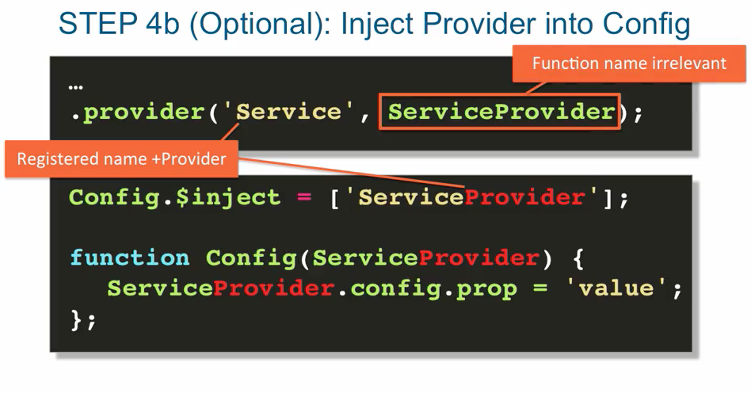

## custom services with .provider()

- . provider() is the most flexible method of creating services in Angular.
- from creating a factory that's dynamically configurable, with provider you can
  custom configured the factory just once at the bootstrapping of your entire application,
  and use the factory through out your application with your custom settings. In other words
  configure the factory, before your application starts.

- the provider method is what actually gets executed behind the scenes when we configured
  our services with either .service or .factory methods.

### steps for using .provider method

- optional default config

- optional define config function
By defining the config function, we're injecting ServiceProvider into the config function.
We cannot inject any regular services into the config function, simply because it gets executed
before any services' factories or controllers are even created.
So we need to get at the provider function over a particular service.
That thing that gets inject into the config function is that string plus the string provider.
So if provider been declared as 'Service', then 'ServiceProvider'.
Then we can use the 'ServiceProvider' instance to get at its properties, like config, and
the config properties to configure it for a particular application.

