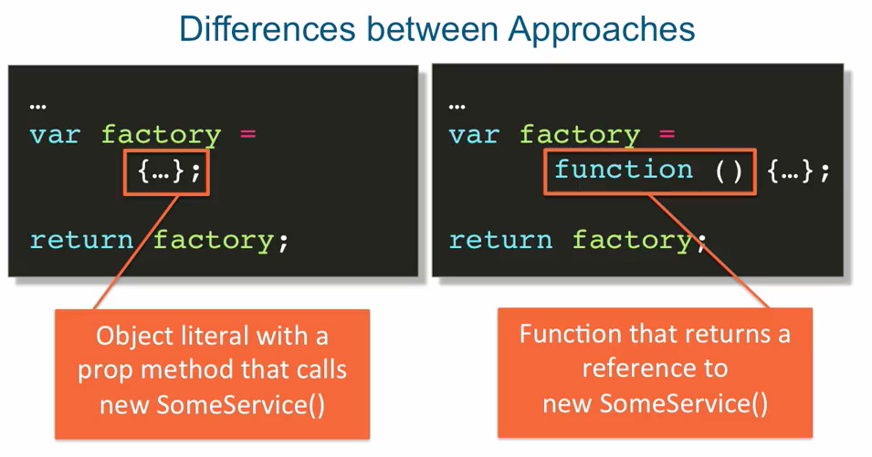

## Custom Services with Factory() method

### factory design patterns
- central place that produces new objects or functions
- a factory can produce any type of object, not just a singleton
- a factory can also be used to produce dynamically customizable services

### factory vs service
- .factory() method is sometimes called a service factory (because a factory is something    
  tha can produce a service)....but

- important differences:
    + .factory() is NOT just another way of creating the same service, you can create    
      with .service(), but it CAN BE.
    + .service() is also a factory, but a much more limited one compared to .factory().
      It's a factory that always produces the same type of service - a singleton, without     
      an easy way to configure its behaviour.


### How to register a Service Factory Function

```
    angular.module('app', [])
    .controller('ctrl', Ctrl)
    .factory('CustomService', CustomService);

```


### service factory function - return function

```
    ex: of a factory function
    =========================

        function CustomService() {
            
            var factory = function() {
                
                return new SomeService();

            };
            //function value
            return factory;

        }


    //this implementation of a factory function returns a function as a result of the
    //execution of our factory function, which is CustomService.

    //the local variable that's returned, factory, is actually a function value.
    //we're ultimately after creating a service called SomeService.


```

- implementing a factory function by returning an object literal

```
    ex: of a factory function

        function CustomService() {

            var factory = {

                getSomeService: function() {

                    return new SomeService();

                }

            };

            return factory;


        }

    // returns an object literal

    // that has a property called getSomeService with a function value

```

- 2 factory functions approaches





### using the object literal approach

- using this approach then you would need to reference your factory function as an       
  object that angular created for you.
- then accessing the method property which is .getSomeService
- since this is an object literal, you then access the property as with like any other     
  obj literal.

### using a function as the return value from the factory function

- using this approach, customService refers to a function.
- so all we need to do is put parentheses to invoke it.
- then someService.method and so on.


