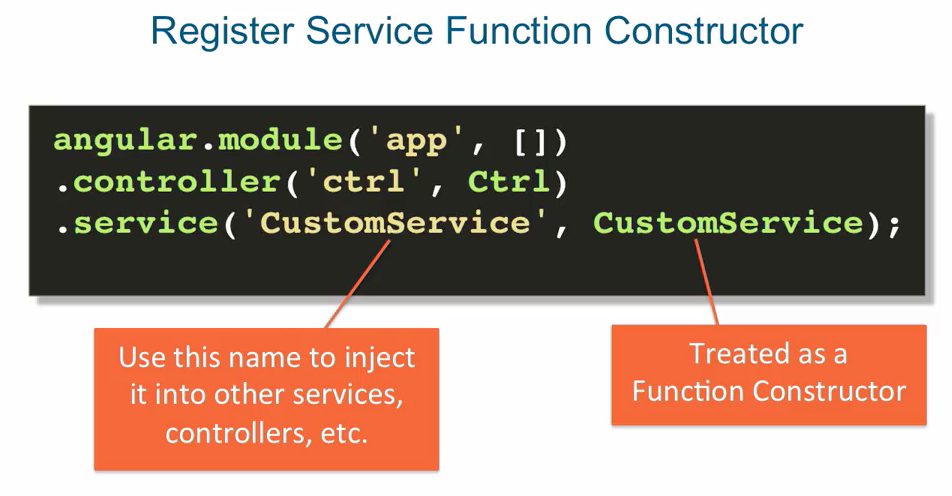
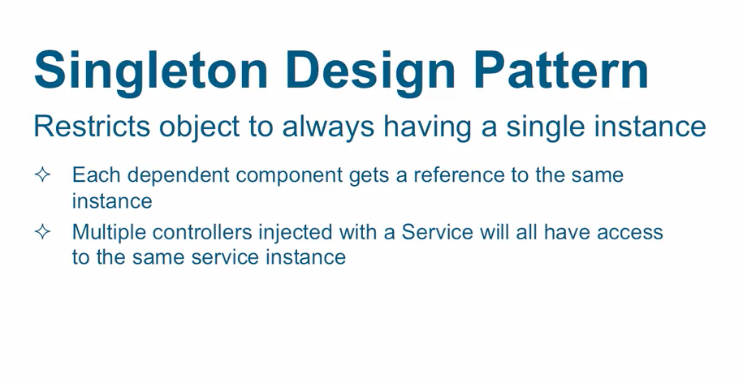

## services

- controllers are the view model in our model view viewmodel design pattern
- the job of the viewmodel is to represent the state of the view
- the way we represent that state if through the data within the controller's instance.
- which happens through the dollar sign scope object
- the controller should not contain much if any business logic itself, but instead..

it should pass on the responsibility of handling business logic to some other components.

#### controllers should not be used to:
- handle business login directly   [X]
- share code or state across controllers  [X]

But with multiple controllers in the same App, it's inevitable that some data will have     
to be shared across some controllers. Controllers shouldn't be used for this type of sharing.

#### the answer: to use a custom Service.

- how to register a custom service:
    + it's very similar to the way a controller is register.
    + using the module instance method called service.
    + it takes the name of the service and the function Constructor used to create service

```
    ex:
        angular.module('app',[])
        .controller('ctrl', Ctrl)
        .service('CustomService', CustomService);

```




    + the service angularJS creates using this method is always a Singleton.




That allows for sharing data between multiple controllers.        
So if you place some data into the service of one controller, you can immediately    
retrieve it in another controller injected with the same service.


