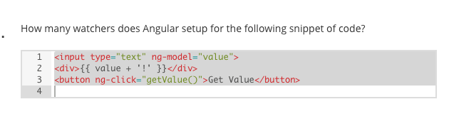

## watchers

- setting up watchers using the $watch function
    + not the best way (setting up watchers inside of the controller function)
```
    ex:

    function MainController($scope) {
        $scope.count = 0;            

        $scope.numberOfWatchers = function() {
            console.log('hit watchers');
            console.log('number of watchers: ', $scope.$$watchersCount);
            $scope.count++;

        };

        //watching count
        $scope.$watch('count', function(newvalue,oldvalue) { 
            console.log('old value: ', oldvalue);
            console.log('new value: ', newvalue);

        });


    }


```
 
### 4 ways to setup watches:

+ Setting up watchers ($watch) inside of your controller is not recommened.
    - this is because the controllers and the templates already have mechanisms that
      automatically set up these watchers.

1- we can set up watches manually through the $watch functions, which are not recommended

```
    $scope.watch
```

2- interpolating using double curly braces in some property and that automatically makes 
   angular setup a watch for you, because once the property changes, it needs to update
   the page.

```
    {{ someProp }}
```

3- using ng-model which is a `2-way data binding`

```
    <input ... ng-model="someProp">
```

4- as shown in function below

```
    $scope.$watch(function() {
        console.log('digest loop fired');

    });

```

> Everything above only applies to things done inside of Angular context or $scope.



- answer is 2 watchers.
- ng-model causes one. Then interpolation of {{ value + '!'}} causes another one.
- interpolation always creates another watch


### $digest and $apply

when code that is not inside of the angular application, but still needs to affect
the values inside of the angular app.


